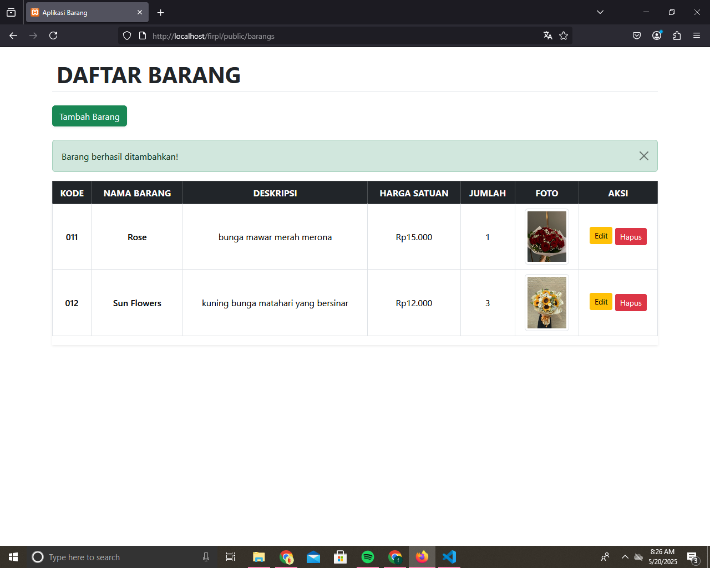
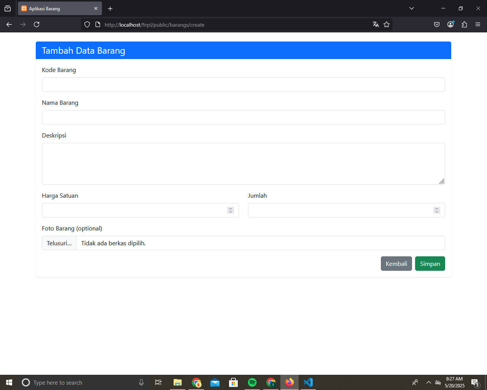
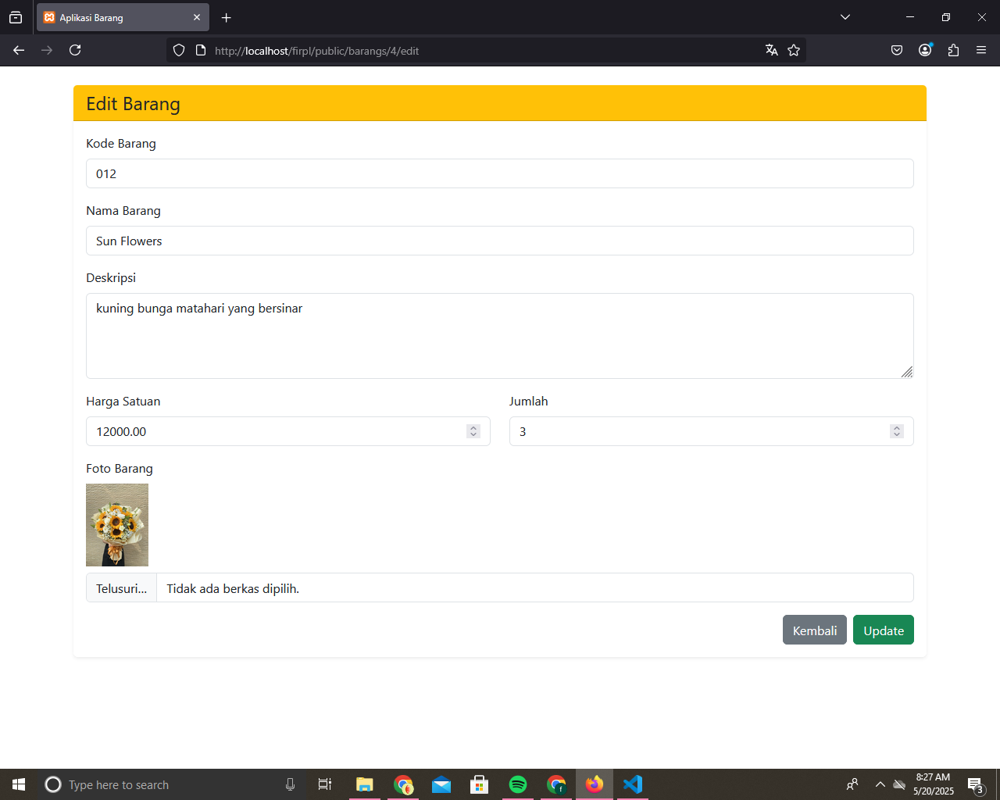

# Proyek CRUD Laravel - Barang

Ini adalah aplikasi CRUD sederhana menggunakan Laravel untuk mengelola data **barang**. Aplikasi ini dibuat untuk memenuhi tugas Rekayasa Perangkat Lunak.

## ✨ Fitur Aplikasi

- Menampilkan daftar barang
- Menambahkan barang baru
- Mengedit data barang
- Menghapus barang
- Menyimpan foto/gambar barang
- Validasi input
- Menggunakan tampilan Bootstrap

## 🛠️ Teknologi yang Digunakan

- Laravel
- PHP
- MySQL
- Bootstrap
- Git & GitHub

## 📸 Tampilan Aplikasi

### ✅ Daftar Barang

### ➕ Tambah Barang

### ✏️ Edit Barang

